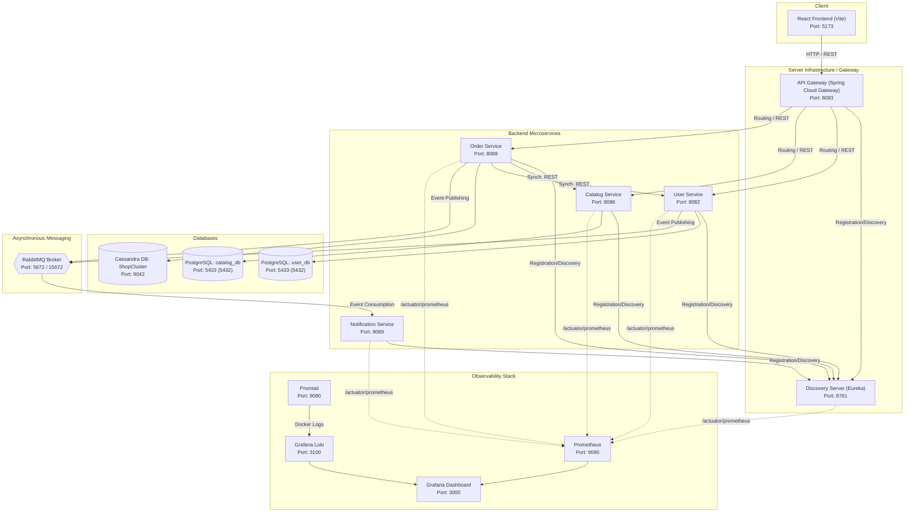

# E-Commerce System Documentation (Microservices Architecture)

## Architecture Diagram



---

## Architecture & Security

### Hexagonal Architecture & Domain-Driven Design (DDD)

Each domain microservice is designed following Hexagonal Architecture (Ports and Adapters) and DDD principles:

* **Domain Layer:** Contains pure business logic (aggregates, value objects, domain exceptions, and domain services) without external framework dependencies (free of Spring/JPA annotations).
* **Application Layer:** Defines Use Cases and In/Out Ports driving data flow.
* **Infrastructure Layer:** Contains Adapters — REST Controllers (Input Adapters), JPA/Cassandra entities, Spring Data repositories, and REST clients (Output Adapters).

### Stateless JWT Authorization

1. **Token Acquisition:** The user authenticates in `user-service` via `/api/v1/auth/login` and receives a cryptographically signed JWT.
2. **API Gateway (Stateless Routing):** The API Gateway receives the request with the `Authorization: Bearer <token>` header. It validates the JWT signature and expiration statelessly without querying the database.
3. **Context Propagation:** Validated user roles and identity are forwarded statelessly via HTTP headers to downstream microservices (`catalog-service`, `order-service`), where dedicated security filters (`JwtAuthenticationFilter`) process the context.

---

## System Microservices & Components

| Service / Component | Port | Database / Reliability | Role in System |
| --- | --- | --- | --- |
| **API Gateway** | `8083` | None (Stateless) | Single entrypoint (Reverse Proxy), request routing, and JWT verification. |
| **Discovery Server (Eureka)** | `8761` | None (In-Memory) | Service Registry for dynamic microservice lookup. |
| **User Service** | `8082` | PostgreSQL (`user_db`) | Account management, Wallet, registration, and authentication. |
| **Catalog Service** | `8086` | PostgreSQL (`catalog_db`) | Product catalog, search, and inventory management. |
| **Order Service** | `8088` | Cassandra DB (`ShopCluster`) | Order creation and management (high availability CQL writes). |
| **Notification Service** | `8089` | None (Event-Driven) | Asynchronous RabbitMQ event consumer (sending emails/push notifications). |
| **React Frontend** | `5173` | Browser Storage | Single Page Application (SPA) built with React + Vite + Tailwind CSS. |
| **RabbitMQ** | `5672` / `15672` | Disk / Memory Queues | Message broker for asynchronous event-driven communication. |
| **PostgreSQL** | `5433` (`5432`) | Relational DB | Persistent storage for user transactions and product catalog. |
| **Cassandra** | `9042` | NoSQL Column-Store | Distributed database optimized for high-volume order writes. |
| **Prometheus** | `9090` | TSDB (Time Series) | Collects application metrics from `/actuator/prometheus` endpoints. |
| **Grafana** | `3000` | SQLite (Internal) | Visualizes metrics and log dashboards. |
| **Loki & Promtail** | `3100` / `9080` | Log Store | Collects Docker logs (Promtail) and indexes them in Loki. |

---

## CI/CD & Testing (Jenkins Pipeline)

The `Jenkinsfile` pipeline automates the complete build and test lifecycle:

1. **Checkout Source:** Pulls source code from the Git repository.
2. **Backend - Unit & Integration Tests:** Runs `mvn clean test`. Integration tests use **Testcontainers** to automatically spin up temporary Docker containers for dependencies like databases and RabbitMQ.
3. **Frontend - Unit Tests:** Installs dependencies (`npm ci`) and runs fast unit tests using **Vitest** (`npm run test:run`).
4. **Build Docker Images:** Compiles backend images via Spring Boot plugin (`mvn spring-boot:build-image`) and builds the frontend Docker image.
5. **E2E Tests (Playwright):** Starts the environment using `docker compose up -d --build`, then executes end-to-end tests (e.g., checkout flows) via **Playwright** (`npx playwright test`). Cleans up with `docker compose down -v` and archives Playwright test artifacts.

---

## Deployment & Setup Guide

### 1. Prerequisites

* **Docker** and **Docker Compose** installed.
* **Java 17+** and **Node.js 20+** installed (if running services locally outside Docker).

### 2. Running Services

Clone the repository and run the following command in the project root:

```bash
docker compose up -d

```

To rebuild images after code changes:

```bash
docker compose up -d --build

```

To shut down containers and clear volume data:

```bash
docker compose down -v

```

---

### 3. Application Endpoints & Dashboard URLs

Once all containers are running, you can access the services at the following URLs:

* **React Frontend App:** [http://localhost:5173](http://localhost:5173)
* **Eureka Discovery Server Dashboard:** [http://localhost:8761](http://localhost:8761)
* **API Gateway Entrypoint:** [http://localhost:8083](http://localhost:8083)
* **RabbitMQ Management Dashboard:** [http://localhost:15672](http://localhost:15672) *(Default login: `guest` / `guest`)*
* **Grafana Dashboards:** [http://localhost:3000](http://localhost:3000) *(Default login: `admin` / `admin`)*
* **Prometheus Metrics Web UI:** [http://localhost:9090](http://localhost:9090)
* **PgAdmin (PostgreSQL GUI):** [http://localhost:5050](http://localhost:5050) *(Default login: `admin@shop.com` / `admin`)*

